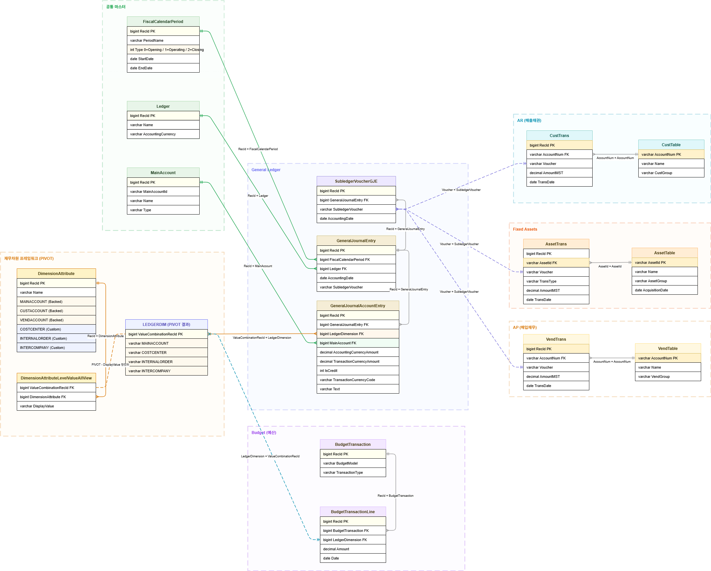

# D365 F&O Finance Table Map

> D365 F&O BI 개발 시 참고용 재무 모듈 테이블 구조 정리  
> GL(총계정원장) · AR(매출채권) · AP(매입채무) · FA(고정자산) · Budget(예산) · 재무차원 PIVOT

---

## ERD

> `d365_finance_erd.drawio` 파일을 [app.diagrams.net](https://app.diagrams.net) 에서 열면 인터랙티브 ERD로 확인 가능




---


## Table Map

### 🔵 GL (총계정원장)

| 테이블명 (영문) | 테이블명 (한국어) | 설명 | BI 활용 포인트 |
|---|---|---|---|
| `GeneralJournalEntry` | 전표 헤더 | 전기(Posting)된 전표의 헤더 정보. 회계일자, 원장, 회계기간 등 전표 수준의 정보를 담음. 모든 GL 분석의 시작점. | 회계일자 기준 기간별 분석, FiscalCalendarPeriod와 조인하여 회계기간 분류(Opening / Operating / Closing) |
| `GeneralJournalAccountEntry` | 원장 라인 (핵심) | 전기된 전표의 개별 분개 라인. 차변/대변 금액, 거래통화, 재무차원 조합(LedgerDimension), 계정과목(MainAccount) 포함. GL 분석의 핵심 팩트 테이블. | `IsCredit`(0=차변/1=대변)으로 차대변 금액 분리, `LedgerDimension`으로 재무차원 PIVOT 조인, `MainAccount`로 계정과목 직접 조인 |
| `SubledgerVoucherGJE` | 보조원장-GL 브릿지 | 보조원장(AR/AP/FA)과 GL을 연결하는 브릿지 테이블. 보조원장 전표번호(SubledgerVoucher)와 GL 전표헤더(RecId)를 매핑. | `CustTrans.Voucher = SubledgerVoucher`로 보조원장→GL 추적. AR/AP/FA 거래의 GL 임팩트 분석에 활용 |

---

### 🟡 재무차원 PIVOT

| 테이블명 (영문) | 테이블명 (한국어) | 설명 | BI 활용 포인트 |
|---|---|---|---|
| `DimensionAttribute` | 차원 종류 정의 | 재무차원의 종류를 정의하는 테이블. **Backed Entity** 차원(시스템 내장, 기준정보 화면 미노출)과 **Custom** 차원(사용자 정의, 기준정보 화면 노출)으로 구분. | `DA.Name` 필드로 차원 종류 필터링. DALVAV 조인 시 WHERE 조건으로 원하는 차원값만 추출 |
| `DimensionAttributeLevelValueAllView` | 차원별 실제값 뷰 | 재무차원 조합별로 각 차원의 실제값을 행으로 저장하는 뷰. PIVOT 처리의 원본 데이터. 예) RecId 5001 → MAINACCOUNT='110100' / COSTCENTER='001' 각 한 행씩 존재. | `DA`와 INNER JOIN 후 `PIVOT(MAX(DisplayValue) FOR Name IN ([MAINACCOUNT],[COSTCENTER],...))` 로 차원을 컬럼으로 펼침 |
| `LEDGERDIM` *(PIVOT 결과)* | 재무차원 PIVOT 결과 | DALVAV를 PIVOT 처리한 서브쿼리 결과. 재무차원 조합 하나가 한 행으로 펼쳐짐. 물리 테이블이 아닌 쿼리 내 서브쿼리. | `ValueCombinationRecId = GJAE.LedgerDimension` 으로 GJAE와 조인. `BudgetTransactionLine.LedgerDimension`과도 동일 구조로 연결하여 예산 vs 실적 비교 가능 |

> **📌 PIVOT 구조 예시**
> ```sql
> SELECT ValueCombinationRecId,
>        MAX(CASE WHEN DA.Name = 'MAINACCOUNT'   THEN DisplayValue END) AS MAINACCOUNT,
>        MAX(CASE WHEN DA.Name = 'COSTCENTER'    THEN DisplayValue END) AS COSTCENTER,
>        MAX(CASE WHEN DA.Name = 'INTERNALORDER' THEN DisplayValue END) AS INTERNALORDER
> FROM DimensionAttributeLevelValueAllView DALVAV
> INNER JOIN DimensionAttribute DA ON DA.RecId = DALVAV.DimensionAttribute
> GROUP BY ValueCombinationRecId
> ```

---

### 🟢 공통 마스터

| 테이블명 (영문) | 테이블명 (한국어) | 설명 | BI 활용 포인트 |
|---|---|---|---|
| `FiscalCalendarPeriod` | 회계 기간 | 회계 달력의 각 기간을 정의하는 마스터. `Type` 필드로 기간 성격 구분: **0=Opening(기초)**, **1=Operating(영업기간)**, **2=Closing(기말)**. | Type=1(Operating) 필터로 정상 영업기간 전표만 추출. 회계연도/분기/월별 그룹핑 기준 |
| `Ledger` | 원장 | 법인별 원장 설정 정보. 회계통화(AccountingCurrency), 원장명(Name) 포함. | `L.AccountingCurrency`로 법인 회계통화 파악. 멀티컴퍼니 환경에서 법인별 분석 그룹핑 기준 |
| `MainAccount` | 계정과목 | 계정과목표의 개별 계정 마스터. 계정코드(MainAccountId), 계정명(Name), 계정유형(Type) 포함. | `M.Name`으로 계정명 표시, `M.Type`으로 손익계산서/재무상태표 계정 분류. `GJAE.MainAccount = RecId`로 직접 조인 |

---

### 🔵 AR (매출채권)

| 테이블명 (영문) | 테이블명 (한국어) | 설명 | BI 활용 포인트 |
|---|---|---|---|
| `CustTable` | 고객 마스터 | 고객 마스터 정보. 고객코드(AccountNum), 고객명(Name), 고객그룹(CustGroup) 포함. | 고객그룹 기준 분석. 고객별 매출/수금 집계 시 디멘션으로 활용 |
| `CustTrans` | 고객 트랜잭션 | 고객에 대한 모든 AR 트랜잭션(청구, 수금, 조정 등). `Voucher`로 SubledgerVoucherGJE와 연결하여 GL 추적 가능. | 고객별 매출채권 발생/수금 분석. `TransDate` 기준 에이징(Aging) 분석 |

---

### 🟠 AP (매입채무)

| 테이블명 (영문) | 테이블명 (한국어) | 설명 | BI 활용 포인트 |
|---|---|---|---|
| `VendTable` | 공급업체 마스터 | 공급업체 마스터 정보. 벤더코드(AccountNum), 벤더명(Name), 벤더그룹(VendGroup) 포함. | 벤더그룹 기준 분석. 벤더별 매입채무/지급 집계 시 디멘션으로 활용 |
| `VendTrans` | 공급업체 트랜잭션 | 공급업체에 대한 모든 AP 트랜잭션(청구, 지급, 조정 등). `Voucher`로 SubledgerVoucherGJE와 연결하여 GL 추적 가능. | 벤더별 매입채무 발생/지급 분석. `TransDate` 기준 에이징(Aging) 분석 |

---

### 🔴 Fixed Assets (고정자산)

| 테이블명 (영문) | 테이블명 (한국어) | 설명 | BI 활용 포인트 |
|---|---|---|---|
| `AssetTable` | 고정자산 마스터 | 고정자산 마스터 정보. 자산코드(AssetId), 자산명(Name), 자산그룹(AssetGroup), 취득일(AcquisitionDate) 포함. | 자산그룹 기준 분류 분석. 취득일 기준 자산 연령 분석 |
| `AssetTrans` | 고정자산 트랜잭션 | 고정자산의 모든 트랜잭션(취득, 감가상각, 처분 등). `TransType`으로 종류 구분. `Voucher`로 GL 추적 가능. | `TransType` 기준 취득/감가상각/처분 구분 분석. 자산별 장부가액 계산 |

---

### 🟣 Budget (예산)

| 테이블명 (영문) | 테이블명 (한국어) | 설명 | BI 활용 포인트 |
|---|---|---|---|
| `BudgetTransaction` | 예산 헤더 | 예산 트랜잭션 헤더. `BudgetModel`로 예산 시나리오(원예산/수정예산 등) 구분. **보조원장이 아닌 계획 데이터이므로 GL로 전기되지 않음.** | `BudgetModel` 기준으로 예산 시나리오 필터링 |
| `BudgetTransactionLine` | 예산 라인 | 예산 개별 라인. `LedgerDimension`이 `GJAE.LedgerDimension`과 동일한 재무차원 구조를 공유하여 **예산 vs 실적 비교 가능**. | `LedgerDimension = LEDGERDIM.ValueCombinationRecId` 조인으로 GJAE와 동일 계정/차원 기준 예산 vs 실적 비교 |

---

## 주요 조인 관계 요약

| From | From 컬럼 | To | To 컬럼 | 설명 |
|---|---|---|---|---|
| `GJAE` | `GeneralJournalEntry` | `GJE` | `RecId` | 원장라인 → 전표헤더 |
| `GJAE` | `LedgerDimension` | `LEDGERDIM` | `ValueCombinationRecId` | 재무차원 PIVOT 조인 |
| `GJAE` | `MainAccount` | `MainAccount` | `RecId` | 계정과목 직접 조인 |
| `GJE` | `FiscalCalendarPeriod` | `FiscalCalendarPeriod` | `RecId` | 회계기간 조인 |
| `GJE` | `Ledger` | `Ledger` | `RecId` | 원장(법인) 조인 |
| `CustTrans` | `Voucher` | `SubledgerVoucherGJE` | `SubledgerVoucher` | AR → GL 브릿지 |
| `VendTrans` | `Voucher` | `SubledgerVoucherGJE` | `SubledgerVoucher` | AP → GL 브릿지 |
| `AssetTrans` | `Voucher` | `SubledgerVoucherGJE` | `SubledgerVoucher` | FA → GL 브릿지 |
| `BudgetTransactionLine` | `LedgerDimension` | `LEDGERDIM` | `ValueCombinationRecId` | 예산 재무차원 조인 |
| `DALVAV` | `DimensionAttribute` | `DimensionAttribute` | `RecId` | 차원종류 조인 |
